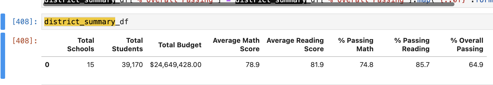

# School District Analysis

## Overview: Explain the purpose of this analysis.

The purpose of this analysis was to provide Maria with high-level school/student performance metrics, district-wide and by school, presented in an easy to read table. This required data cleaning and data/table reforatting because it was discovered that the test scores for ninth grade students at Thomas High School were flawed, and it was decided that they be removed from the dataset. 

## Results: Using bulleted lists and images of DataFrames as support, address the following questions.

### How is the district summary affected?
District Summary before removing ninth graders scores:

District Summary after removing ninth graders scores:

Changes were seen to the following data categories:
Average math score went down from 79 to 78.9
Average reading score stayed the same
% passing math score went down from 75% to 74.8%
% passing reading down from 86% to 85.7%
Overall passing went down from 65% to 64.9%

### How is the school summary affected?

Before removing ninth graders: 90.1% overall passing rate

After removing ninth graders: 65.1% overall passing rate 

### How does replacing the ninth graders’ math and reading scores affect Thomas High School’s performance relative to the other schools?

Thomas High School (by overall passing %) was the #2 school overall. After replacing the ninth grader's math and reading scores, their rank fell to #13 out of 15. 

### How does replacing the ninth-grade scores affect the following:

### Math and reading scores by grade
Nothing was affected aside from the fact that Thomas High School 9th grade went from having posted score to NaN, or not-a-number.

### Scores by school spending
It does not appear that replacing ninth-grade scores affected school spending. The changes were so small, they were statistically insignificant.

### Scores by school size
The overall passing % for Medium Sized Schools fell by .13% after ninth-graders scores were removed. 

### Scores by school type
The overall passing % for Charter Schools fell 0.04% after ninth-graders scores were removed from the anaylsis. 
Passing reading fell by 0.03% and passing math fell by 0.01%. 

##  Summary: Summarize four changes in the updated school district analysis after reading and math scores for the ninth grade at Thomas High School have been replaced with NaNs.
- The greatest change to the analysis after replacing math and reading scores for THS ninth grade was the overall school summary passing rate. which fell from 90.1% passing rate to a 65.1% passing rate 
- The other analyses calculating the change by grade, school spending, size, and school type, were not significantly altered by the removal of the ninth-graders scores. 
